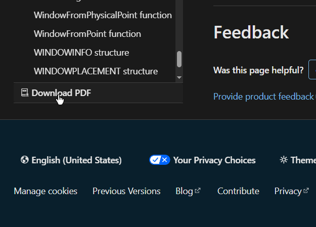

While researching some Windows API stuff, I noticed that there's a "Download PDF" button under the left nav

> 

This brings us to a page with the following url

> https://learn.microsoft.com/pdf?url=https%3A%2F%2Flearn.microsoft.com%2Fen-us%2Fwindows%2Fwin32%2Fapi%2F_winmsg%2Ftoc.json

By changing the url, I found

> https://learn.microsoft.com/pdf?url=https%3A%2F%2Flearn.microsoft.com%2Fen-us%2Fwindows%2Fwin32%2Fapi%2Ftoc.json

>  **Programming reference for the Win32 API**
> 
>  The Win32 API reference documentation is presented in several different views. You can
>  browse a list of popular technologies on this page, or you can browse the full list of
>  technologies in the table of contents. To browse all of the headers, see the list at the
>  bottom of the table of contents

> **TranslateMessage**
> 
> Translates virtual-key messages into character messages. The character messages are posted to
> the calling thread's message queue, to be read the next time the thread calls the GetMessage orPeekMessage function.

The link on the name brings us to the ms docs page, the important info is not in the PDF.

This is a 9858 page PDF of all the names but none of the content

> https://learn.microsoft.com/pdf?url=https%3A%2F%2Flearn.microsoft.com%2Fen-us%2Fwindows%2Fwin32%2Fapi%2F_winmsg%2Ftoc.json
>
> **Windows and Messages**
>
> Overview of the Windows and Messages technology.
> The Windows and Messages technology is not associated with any headers.
> For programming guidance for this technology, see:
>  - [Windows and Messages](https://learn.microsoft.com/en-us/windows/desktop/winmsg)

This is a much more reasonable 1094 pages and it does contain the details when we click the links within, simply jumping us to other pages

> **TranslateMessage function (winuser.h)**
>
> *Article 08/04/2022*
>
> Translates virtual-key messages into character messages. The character messages are posted to the calling thread's message queue, to be read the next time the thread calls the GetMessage or PeekMessage function.
>
> **Syntax**
> ```c++
> BOOL TranslateMessage(
>   [in] const MSG *lpMsg
> );
> ```
>
> **Parameters**
>
> `[in] lpMsg`
> - Type: const MSG*
> - A pointer to an MSG structure that contains message information retrieved from the calling thread's message queue by using the GetMessage or PeekMessage function.
>
> **Return value**
>
> Type: BOOL
>
> - If the message is translated (that is, a character message is posted to the thread's message queue), the return value is nonzero.
> - If the message is WM_KEYDOWN, WM_KEYUP, WM_SYSKEYDOWN, or WM_SYSKEYUP, the return value is nonzero, regardless of the translation.
> - If the message is not translated (that is, a character message is not posted to the thread's message queue), the return value is zero.
>
> **Remarks**
>
> The TranslateMessage function does not modify the message pointed to by the lpMsg parameter.
>
> WM_KEYDOWN and WM_KEYUP combinations produce a WM_CHAR or WM_DEADCHAR message. WM_SYSKEYDOWN and WM_SYSKEYUP combinations produce a WM_SYSCHAR or WM_SYSDEADCHAR message.
>
> TranslateMessage produces WM_CHAR messages only for keys that are mapped to ASCII characters by the keyboard driver.
>
> If applications process virtual-key messages for some other purpose, they should not call TranslateMessage. For instance, an application should not call TranslateMessage if the TranslateAccelerator function returns a nonzero value. Note that the application is responsible for retrieving and dispatching input messages to the dialog box. Most applications use the main message loop for this. However, to permit the user to move to and to select controls by using the keyboard, the application must call IsDialogMessage. For more information, see Dialog Box Keyboard Interface.
>
> **Examples**
>
> For an example, see Creating a Message Loop.
>
> **Requirements**
>
> | Requirement | Value |
> |------------|-------|
> | Minimum supported client | Windows 2000 Professional [desktop apps only] |
> | Minimum supported server | Windows 2000 Server [desktop apps only] |
> | Target Platform | Windows |
> | Header | winuser.h (include Windows.h) |
> | Library | User32.lib |
> | DLL | User32.dll |
> | API set | ext-ms-win-ntuser-message-l1-1-0 (introduced in Windows 8) |
>
> **See also**
> - GetMessage
> - IsDialogMessage
> - Messages and Message Queues
> - PeekMessage
> - TranslateAccelerator
> - WM_CHAR
> - WM_DEADCHAR
> - WM_KEYDOWN
> - WM_KEYUP
> - WM_SYSCHAR
> - WM_SYSDEADCHAR
> - WM_SYSKEYDOWN
> - WM_SYSKEYUP
> - Keyboard Input


Having a structured representation of these APIs would be useful.
I'd prefer JSON or something, but pdf isn't too bad.

I wonder what other people use these PDFs for?

> GitHub Code search results: "https://learn.microsoft.com/pdf"  
> https://github.com/search?q=%22https%3A%2F%2Flearn.microsoft.com%2Fpdf%22&ref=opensearch&type=code&p=1


- https://github.com/tedneward/Research/blob/d699a48333f264316b83f543efc175348642bf77/content/distribution/aspire.md?plain=1#L6

```md
title=Aspire
tags=distribution, clr
summary=An opinionated stack for building resilient, observable, and configurable cloud-native applications with .NET.
~~~~~~

[Website](https://learn.microsoft.com/en-us/dotnet/aspire/) ([PDF](https://learn.microsoft.com/pdf?url=https%3A%2F%2Flearn.microsoft.com%2Fen-us%2Fdotnet%2Faspire%2Ftoc.json) - big! 1100+ pages!) | [Source](https://github.com/dotnet/aspire) | [Quickstart](https://learn.microsoft.com/en-us/dotnet/aspire/get-started/build-your-first-aspire-app) | [Add Aspire to an existing app Tutorial](https://learn.microsoft.com/en-us/dotnet/aspire/get-started/add-aspire-existing-app)

## Articles

["Introducing .NET Aspire: Simplifying Cloud-Native Development with .NET 8"](https://devblogs.microsoft.com/dotnet/introducing-dotnet-aspire-simplifying-cloud-native-development-with-dotnet-8/)
```

A dude's open visibility research notes, very neat.

---

- https://github.com/rh-mobb/documentation/blob/f31fc140058512bfdcde2b564b6a89a957f9408d/content/rhoai/aro-rag/index.md?plain=1#L12

```md
---
date: '2024-12-10'
title: Creating RAG Chatbot using TinyLlama and LangChain with Red Hat OpenShift AI on ARO
tags: ["ARO", "RHOAI", "Jupyter", "RAG", "Chatbot", "TinyLlama", "LangChain"]
authors:
  - Diana Sari
---

## 1. Introduction
[Retrieval-Augmented Generation](https://en.wikipedia.org/wiki/Retrieval-augmented_generation) (RAG) is a technique to enhance Large Language Models (LLMs) to retrieve relevant information from a knowledge base before generating responses, rather than relying solely on their training. [LangChain](https://github.com/langchain-ai/langchain) is a framework for developing applications powered by language models. It provides tools and APIs that make it easier to create complex applications using LLMs, such as using RAG technique to enable the chatbot to answer questions based on the provided document.

This tutorial is a simple guide on how to create RAG chatbot that can provide sufficient response when asked about ARO based on [official ARO documentation](https://learn.microsoft.com/pdf?url=https%3A%2F%2Flearn.microsoft.com%2Fen-us%2Fazure%2Fopenshift%2Ftoc.json), which consists of 421 PDF pages at the time of writing. We will be using [Red Hat OpenShift AI](https://www.redhat.com/en/technologies/cloud-computing/openshift/openshift-ai) (RHOAI), formerly called Red Hat OpenShift Data Science (RHODS), which is an OpenShift platform for AI/ML projects management, and we will be running this on an [Azure Red Hat OpenShift](https://azure.microsoft.com/en-us/products/openshift) (ARO) cluster, which is our managed service OpenShift platform on Azure. 

Here we will create a chatbot using [TinyLlama](https://arxiv.org/abs/2401.02385) model and we will use several key components from LangChain for document loading (`PyPDFLoader`), text splitting (`RecursiveCharacterTextSpliter`), vector store (`FAISS`), retrieval chain (`RetrievalQA`), and prompt templates (`PromptTemplate`), to help build our chatbot. And at the end of this tutorial, there will be an optional section to create another RAG system using [GPT-4](https://en.wikipedia.org/wiki/GPT-4) model via [Azure OpenAI Service](https://azure.microsoft.com/en-us/products/ai-services/openai-service), and from there we will compare the responses from both systems.

*Disclaimer: When interacting with chatbots and AI language models, please be aware that while these systems include content filters and safety features, they are not infallible. It is your responsibility to use these tools appropriately and ensure your interactions are suitable. Neither the author of this tutorial nor the service providers can be held responsible for any unexpected or inappropriate responses. By proceeding, you acknowledge that AI responses can be unpredictable and may occasionally contain inaccuracies or deviate from the expected behavior. It is important to review and verify any critical information or advice received from these systems before acting upon it. In addition, please note that user interfaces may change over time as the products evolve. Some screenshots and instructions may not exactly match what you see.*
...truncated
```

RAG stuff, about what I expected given the PDF form-factor

---

- https://github.com/chakerayachii/Azure-Docs-PDF-Downloader/blob/4fb00896dd6f850adb2b04e804a76c2c22f7cea2/download_and_clean.sh#L16

```sh
!/bin/bash


# Define directory names
download_dir="azure-docs"
clean_dir="docs-clean"

# Create the directory for downloaded PDFs
if [ ! -d "$download_dir" ]; then
    mkdir "$download_dir"
fi

alias urldecode='python3 -c "import sys, urllib.parse as ul; print(ul.unquote_plus(sys.argv[1]))"'
alias urlencode='python3 -c "import sys, urllib.parse as ul;  print (ul.quote_plus(sys.argv[1]))"'
### example
# https://learn.microsoft.com/pdf\?url\=https://learn.microsoft.com/en-us/azure/app-service/toc.json
startUrl='https://learn.microsoft.com/pdf?url='
for row in $(curl https://api.github.com/repos/MicrosoftDocs/azure-docs/contents/articles | jq -c -r '.[] | select(.type | contains("dir")) | "\(.name)"'); do
    enc=$(urlencode https://learn.microsoft.com/en-us/azure/${row}/toc.json)
    wget -O "${download_dir}/${row}.pdf" "${startUrl}${enc}"
done

# Run Python script to clean up downloaded PDFs
python3 cleanDocs.py
```

Bulk downloader, kewl.

---

- https://github.com/fonttools/fontbakery/blob/5e5b8f6cbf749e34bbf854f60613e7d19a42ae4e/Lib/fontbakery/data/fontbakery-microsoft-vendorlist.cache#L43

```xml
<meta name="pdf_url_template" content="https://learn.microsoft.com/pdfstore/en-us/Win.typography/{branchName}{pdfName}" />
```

idk what this .cache file is about.
This is the only spot in the repo that `pdf_url_template` is mentioned

---

- https://github.com/BlindHelp/BlindHelp.github.io/blob/fa1c9ccbf292cb9e7bffed70b824cb9c901f00cb/_posts/2023-11-28-Terminal%20Windows.md?plain=1#L204

```md

Pour en savoir plus sur le Terminal Windows, vous pouvez consulter la documentation en ligne (PDF), à partir du lien ci-dessous :    

[windows terminal - Microsoft Learn](https://learn.microsoft.com/pdf?url=https%3A%2F%2Flearn.microsoft.com%2Ffr-fr%2Fwindows%2Fterminal%2Ftoc.json)

Vous pouvez utiliser le bouton appelé "Télécharger" sur ladite page pour télécharger cette documentation en PDF  à l'aide de votre navigateur par défaut pour l'enregistrer sous votre disque dur pour une future consultation hors ligne.    
```

Someone simply linking to the PDF as actual documentation in their docs

---

- https://github.com/BLTGreen/Architecture-Repo/blob/9d0eb20c05591bb6a38e07e6e51b5ee329c0d42a/metamodel/architectureFramework/azureWellArchitected.md?plain=1#L5

```md
# Azure Well Architected

Normally I embed PDFs of frameworks into my repositories, but the Azure Well Architected Framework is even longer than the AWS version, with over 1200 pages.

To save on bandwidth, I traditionally instead place a link [https://learn.microsoft.com/pdf?url=https%3A%2F%2Flearn.microsoft.com%2Fen-us%2Fazure%2Fwell-architected%2Ftoc.json](here).
```

Again being linked as docs. Someone's cloud architecture documentation

---

- https://github.com/bosterptr/nthwse/blob/ba7237d4f46b30f1469ccbef3631809142b4aaa4/scraper/raw/926.html#L40

```xml
<meta name="pdf_url_template" content="https://learn.microsoft.com/pdfstore/en-us/MSDN.manufacture-oem/{branchName}{pdfName}">
```

Oh I get it.
Someone has scraped the webpage.

This repo has many scraped sites.

Saves me trouble if I wanted to scrape stuff, instead I just should search GitHub to see if someone has already scraped it lol

---

- https://github.com/jamalmazrui/KeyLine/blob/361fc219a34accdf1415bc6fbd578082b377ebf3/help/PsKill.html#L45


```xml
<meta name="pdf_url_template" content="https://learn.microsoft.com/pdfstore/en-us/MSDN.sysinternals/{branchName}{pdfName}" />
```

Another case of the website being saved, but this repo has some interesting command line scripts

---

- https://github.com/Shishir435/Google-Clone/blob/8e9563cca070df4ec33979881f11c93aa7ec3b1f/src/response.js#L372

```js
 pdf_url_template:
              "https://learn.microsoft.com/pdfstore/en-us/VS.core-docs/{branchName}{pdfName}",
            "og:type": "website",
            "og:image:alt": "null keyword - C# Reference | Microsoft Learn",
            persistent_id: "1ea94cfe-3af5-97ba-40f8-2a55099528cf",
            author: "BillWagner",
            "og:title": "null keyword - C# Reference",
```

Not much docs here, but the repo name is a bit of a hint?

---

- https://github.com/MerCILL/ALevelPractice/blob/e03c83ba0f6c4ab17f4f2df7c69d838c9355d805/Module3HM5_Threads/HttpClient_MapReduce/Files/site1.txt#L97

```xml
<meta name="pdf_url_template" content="https://learn.microsoft.com/pdfstore/en-us/Azure.azure-documents/{branchName}{pdfName}" />
```

Someone's learning repo with some copies of the docs?

---

- https://github.com/Anurag9507/ImageEffectProject/blob/d1d951eb9d496d0144d50ab17f46f404b03f54d5/ImageEffectFrontend/wsl2kernel.deb#L100

```xml

<meta name="pdf_url_template" content="https://learn.microsoft.com/pdfstore/en-us/WS.wsl/{branchName}{pdfName}" />
```

```md
ImageEffectApplication
ImageEffectApplication is a software that applies various image effects, such as contrast, saturation etc. to the image and stores logs of each applied effect.

We have implemented this project as part of our Programming-2 course.
```

A student project, neato

---


- https://github.com/Hansimov/purehtml/blob/6818497bb13591554c66b4ea4e412dccf3de2f03/src/purehtml/samples/Chat%20Completions%20-%20Azure.html#L106

```xml
<meta name="pdf_url_template" content="https://learn.microsoft.com/pdfstore/en-us/Azure.azure-documents/{branchName}{pdfName}" />
```

```md
# PureHTML
Purify HTML by filtering tags and classes


## Install

\```sh
pip install --upgrade purehtml
\```

## Usage

\```python
from purehtml import purify_html_files
from pathlib import Path

html_root = Path(__file__).parent / "samples"
html_paths = list(html_root.glob("*.html"))
html_path_and_purified_content_list = purify_html_files(html_paths)
for item in html_path_and_purified_content_list:
    html_path = item["html_path"]
    purified_content = item["purified_content"]
    print(html_path)
    print(purified_content)
\```
```

neat.

---
---
---

So far, this one is the most interesting

- https://github.com/chakerayachii/Azure-Docs-PDF-Downloader/blob/4fb00896dd6f850adb2b04e804a76c2c22f7cea2/download_and_clean.sh#L16

```sh
!/bin/bash


# Define directory names
download_dir="azure-docs"
clean_dir="docs-clean"

# Create the directory for downloaded PDFs
if [ ! -d "$download_dir" ]; then
    mkdir "$download_dir"
fi

alias urldecode='python3 -c "import sys, urllib.parse as ul; print(ul.unquote_plus(sys.argv[1]))"'
alias urlencode='python3 -c "import sys, urllib.parse as ul;  print (ul.quote_plus(sys.argv[1]))"'
### example
# https://learn.microsoft.com/pdf\?url\=https://learn.microsoft.com/en-us/azure/app-service/toc.json
startUrl='https://learn.microsoft.com/pdf?url='
for row in $(curl https://api.github.com/repos/MicrosoftDocs/azure-docs/contents/articles | jq -c -r '.[] | select(.type | contains("dir")) | "\(.name)"'); do
    enc=$(urlencode https://learn.microsoft.com/en-us/azure/${row}/toc.json)
    wget -O "${download_dir}/${row}.pdf" "${startUrl}${enc}"
done

# Run Python script to clean up downloaded PDFs
python3 cleanDocs.py
```


This link

https://api.github.com/repos/MicrosoftDocs/azure-docs/contents/articles

brings us to a json document enumerating the contents of a directory on GitHub.

I wonder if MicrosoftDocs has other repos


- https://github.com/orgs/MicrosoftDocs/repositories?type=source&q=sort%3Aname-asc+windows
- https://github.com/MicrosoftDocs/Console-Docs
- https://github.com/MicrosoftDocs/SimpleRecorder - A sample app demonstrating the use of Windows.Graphics.Capture APIs to capture the screen to a video file.
- https://github.com/MicrosoftDocs/winapps-win32-api - Public mirror for the Windows App SDK win32 API docs repo - 9498c85 · 9 months ago

Bingo

- https://github.com/search?q=repo%3AMicrosoftDocs%2Fwinapps-win32-api%20TranslateMessage&type=code
- https://github.com/MicrosoftDocs/winapps-win32-api/blob/9498c85d3516749e880351f5e1cfeb12b4419ca4/winapps-win32-src/content/microsoft.ui.dispatching.interop/nf-microsoft-ui-dispatching-interop-contentpretranslatemessage.md?plain=1#L2


except not, that's ContentPreTranslateMessage not TranslateMessage

Which made me realize, now that I've (re)discovered the MicrosoftDocs owner, I can just search GitHub for that

- `owner:MicrosoftDocs TranslateMessage path:.md`
- https://github.com/search?q=owner%3AMicrosoftDocs+TranslateMessage+path%3A.md&ref=opensearch&type=code


Haven't read these yet but these are the results that stood out enough for me to open a new tab


- [Code search results](https://github.com/search?q=owner%3AMicrosoftDocs+TranslateMessage+path%3A.md&ref=opensearch&type=code&p=5)
- [sdk-api/sdk-api-src/content/winuser/nf-winuser-translatemessage.md at e992af27b9fc084e4092dc1fee24d5c533a3a313 · MicrosoftDocs/sdk-api](https://github.com/MicrosoftDocs/sdk-api/blob/e992af27b9fc084e4092dc1fee24d5c533a3a313/sdk-api-src/content/winuser/nf-winuser-translatemessage.md?plain=1#L2)
- [win32/desktop-src/winmsg/translatemessageex.md at 261f45aaea567eed532c4a8e950cd031369176de · MicrosoftDocs/win32](https://github.com/MicrosoftDocs/win32/blob/261f45aaea567eed532c4a8e950cd031369176de/desktop-src/winmsg/translatemessageex.md?plain=1#L3)
- [SupportArticles-docs/support/windows/win32/ime-crash-processing-cross-thread-sent-message.md at dc8995350dd3cfa9a76ca17bc7b56d3715149bbf · MicrosoftDocs/SupportArticles-docs](https://github.com/MicrosoftDocs/SupportArticles-docs/blob/dc8995350dd3cfa9a76ca17bc7b56d3715149bbf/support/windows/win32/ime-crash-processing-cross-thread-sent-message.md?plain=1#L17)
- [win32/desktop-src/inputdev/wm-char.md at 261f45aaea567eed532c4a8e950cd031369176de · MicrosoftDocs/win32](https://github.com/MicrosoftDocs/win32/blob/261f45aaea567eed532c4a8e950cd031369176de/desktop-src/inputdev/wm-char.md?plain=1#L3)
- [webview2-win32-reference/0-9-579/icorewebview2controller.md at 6237ec3085bbc9d8747c7c776c3c9ce2b2f495c6 · MicrosoftDocs/webview2-win32-reference](https://github.com/MicrosoftDocs/webview2-win32-reference/blob/6237ec3085bbc9d8747c7c776c3c9ce2b2f495c6/0-9-579/icorewebview2controller.md?plain=1#L314)
- [windows-dev-docs/hub/apps/develop/dispatcherqueue.md at e7f535c17d7a78eb98281ce56b110db8611d3683 · MicrosoftDocs/windows-dev-docs](https://github.com/MicrosoftDocs/windows-dev-docs/blob/e7f535c17d7a78eb98281ce56b110db8611d3683/hub/apps/develop/dispatcherqueue.md?plain=1#L56)
- [win32/desktop-src/inputdev/wm-keydown.md at 261f45aaea567eed532c4a8e950cd031369176de · MicrosoftDocs/win32](https://github.com/MicrosoftDocs/win32/blob/261f45aaea567eed532c4a8e950cd031369176de/desktop-src/inputdev/wm-keydown.md?plain=1#L105)
- [SupportArticles-docs/support/windows/win32/application-using-message-filters-unresponsive-win10.md at dc8995350dd3cfa9a76ca17bc7b56d3715149bbf · MicrosoftDocs/SupportArticles-docs](https://github.com/MicrosoftDocs/SupportArticles-docs/blob/dc8995350dd3cfa9a76ca17bc7b56d3715149bbf/support/windows/win32/application-using-message-filters-unresponsive-win10.md?plain=1#L41)
- [sdk-api/sdk-api-src/content/immdev/nf-immdev-immgetvirtualkey.md at e992af27b9fc084e4092dc1fee24d5c533a3a313 · MicrosoftDocs/sdk-api](https://github.com/MicrosoftDocs/sdk-api/blob/e992af27b9fc084e4092dc1fee24d5c533a3a313/sdk-api-src/content/immdev/nf-immdev-immgetvirtualkey.md?plain=1#L65)
- [win32/desktop-src/LearnWin32/window-messages.md at 261f45aaea567eed532c4a8e950cd031369176de · MicrosoftDocs/win32](https://github.com/MicrosoftDocs/win32/blob/261f45aaea567eed532c4a8e950cd031369176de/desktop-src/LearnWin32/window-messages.md?plain=1#L46)
- [win32/desktop-src/inputdev/using-keyboard-input.md at 261f45aaea567eed532c4a8e950cd031369176de · MicrosoftDocs/win32](https://github.com/MicrosoftDocs/win32/blob/261f45aaea567eed532c4a8e950cd031369176de/desktop-src/inputdev/using-keyboard-input.md?plain=1#L83)
- [win32/desktop-src/winmsg/using-window-classes.md at 261f45aaea567eed532c4a8e950cd031369176de · MicrosoftDocs/win32](https://github.com/MicrosoftDocs/win32/blob/261f45aaea567eed532c4a8e950cd031369176de/desktop-src/winmsg/using-window-classes.md?plain=1#L48)
- [sdk-api/sdk-api-src/content/winuser/nf-winuser-getmessagea.md at e992af27b9fc084e4092dc1fee24d5c533a3a313 · MicrosoftDocs/sdk-api](https://github.com/MicrosoftDocs/sdk-api/blob/e992af27b9fc084e4092dc1fee24d5c533a3a313/sdk-api-src/content/winuser/nf-winuser-getmessagea.md?plain=1#L142)
- [win32/desktop-src/Multimedia/monitoring-compressor-and-decompressor-progress.md at 261f45aaea567eed532c4a8e950cd031369176de · MicrosoftDocs/win32](https://github.com/MicrosoftDocs/win32/blob/261f45aaea567eed532c4a8e950cd031369176de/desktop-src/Multimedia/monitoring-compressor-and-decompressor-progress.md?plain=1#L57)
- [win32/desktop-src/winmsg/using-timers.md at 261f45aaea567eed532c4a8e950cd031369176de · MicrosoftDocs/win32](https://github.com/MicrosoftDocs/win32/blob/261f45aaea567eed532c4a8e950cd031369176de/desktop-src/winmsg/using-timers.md?plain=1#L99)
- [win32/desktop-src/inputdev/about-keyboard-input.md at 261f45aaea567eed532c4a8e950cd031369176de · MicrosoftDocs/win32](https://github.com/MicrosoftDocs/win32/blob/261f45aaea567eed532c4a8e950cd031369176de/desktop-src/inputdev/about-keyboard-input.md?plain=1#L75)
- [win32/desktop-src/menurc/keyboard-accelerators.md at 261f45aaea567eed532c4a8e950cd031369176de · MicrosoftDocs/win32](https://github.com/MicrosoftDocs/win32/blob/261f45aaea567eed532c4a8e950cd031369176de/desktop-src/menurc/keyboard-accelerators.md?plain=1#L74)
- [win32/desktop-src/inputdev/using-mouse-input.md at 261f45aaea567eed532c4a8e950cd031369176de · MicrosoftDocs/win32](https://github.com/MicrosoftDocs/win32/blob/261f45aaea567eed532c4a8e950cd031369176de/desktop-src/inputdev/using-mouse-input.md?plain=1#L523)
- [win32/desktop-src/Direct2D/direct2d-quickstart.md at 261f45aaea567eed532c4a8e950cd031369176de · MicrosoftDocs/win32](https://github.com/MicrosoftDocs/win32/blob/261f45aaea567eed532c4a8e950cd031369176de/desktop-src/Direct2D/direct2d-quickstart.md?plain=1#L165)
- [win32/desktop-src/OpenGL/the-program-ported-to-win32.md at 261f45aaea567eed532c4a8e950cd031369176de · MicrosoftDocs/win32](https://github.com/MicrosoftDocs/win32/blob/261f45aaea567eed532c4a8e950cd031369176de/desktop-src/OpenGL/the-program-ported-to-win32.md?plain=1#L109)
- [win32/desktop-src/winmsg/messages-and-message-queues.md at 261f45aaea567eed532c4a8e950cd031369176de · MicrosoftDocs/win32](https://github.com/MicrosoftDocs/win32/blob/261f45aaea567eed532c4a8e950cd031369176de/desktop-src/winmsg/messages-and-message-queues.md?plain=1#L60)
- [win32/desktop-src/Controls/create-a-simple-combo-box.md at 261f45aaea567eed532c4a8e950cd031369176de · MicrosoftDocs/win32](https://github.com/MicrosoftDocs/win32/blob/261f45aaea567eed532c4a8e950cd031369176de/desktop-src/Controls/create-a-simple-combo-box.md?plain=1#L389)
- [win32/desktop-src/direct3dgetstarted/work-with-dxgi.md at 261f45aaea567eed532c4a8e950cd031369176de · MicrosoftDocs/win32](https://github.com/MicrosoftDocs/win32/blob/261f45aaea567eed532c4a8e950cd031369176de/desktop-src/direct3dgetstarted/work-with-dxgi.md?plain=1#L168)

This looks like the right one

https://github.com/MicrosoftDocs/sdk-api/blob/e992af27b9fc084e4092dc1fee24d5c533a3a313/sdk-api-src/content/winuser/nf-winuser-translatemessage.md?plain=1#L2

if I wanted the markdown source for the PDF/website I've been referencing

https://github.com/MicrosoftDocs/sdk-api/blob/e992af27b9fc084e4092dc1fee24d5c533a3a313/LICENSE  
Creative Commons Attribution 4.0 International

https://github.com/MicrosoftDocs/sdk-api/blob/e992af27b9fc084e4092dc1fee24d5c533a3a313/LICENSE-CODE  
The MIT License (MIT)

e992af2
 · 
4 days ago


  
54 PRs open | 1,939 Closed

```
G:\Programming\Repos
❯ git clone https://github.com/bosterptr/nthwse nthwse-scraper
Cloning into 'nthwse-scraper'...
remote: Enumerating objects: 9041, done.
remote: Counting objects: 100% (119/119), done.
remote: Compressing objects: 100% (85/85), done.
remote: Total 9041 (delta 38), reused 95 (delta 22), pack-reused 8922 (from 1)
Receiving objects: 100% (9041/9041), 647.40 MiB | 57.63 MiB/s, done.
Resolving deltas: 100% (976/976), done.
Updating files: 100% (11759/11759), done.
G:\Programming\Repos took 20s
❯ git clone https://github.com/MicrosoftDocs/sdk-api microsoft-docs-sdk-api
Cloning into 'microsoft-docs-sdk-api'...
remote: Enumerating objects: 3188295, done.
remote: Counting objects: 100% (1812/1812), done.
remote: Compressing objects: 100% (347/347), done.
remote: Total 3188295 (delta 1687), reused 1463 (delta 1463), pack-reused 3186483 (from 3)
Receiving objects: 100% (3188295/3188295), 1.12 GiB | 58.72 MiB/s, done.
Resolving deltas: 100% (3027044/3027044), done.
error: unable to create file sdk-api-src/content/d3d11/nf-d3d11-cd3d11_sampler_desc-cd3d11_sampler_desc(d3d11_filter_d3d11_texture_address_mode_d3d11_texture_address_mode_d3d11_texture_address_mode_float_uint_d3d11_comparison_func_constfloat_.md: Filename too long
Updating files: 100% (66516/66516), done.
fatal: unable to checkout working tree
warning: Clone succeeded, but checkout failed.
You can inspect what was checked out with 'git status'
and retry with 'git restore --source=HEAD :/'
```